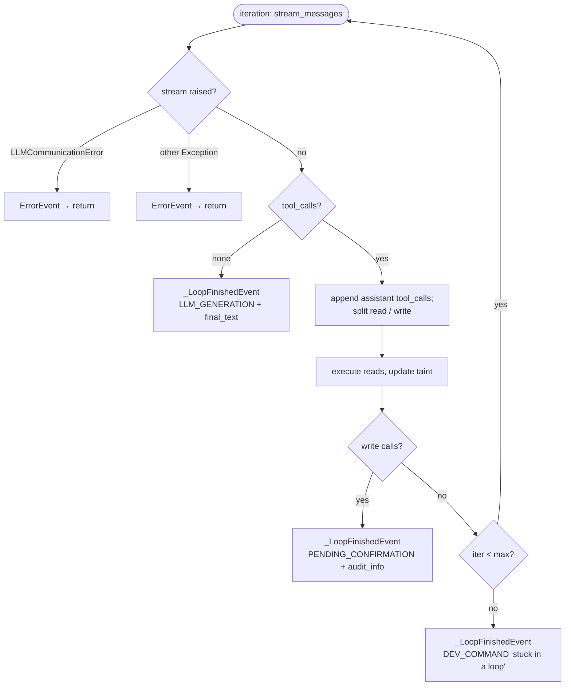

# Tool-use loop — exit paths & cleanup invariants

Design reference for the agent tool-use loop. The happy path (stream → tool
calls → execute → repeat) is readable in the code; what is *not* obvious is the
fan-out of **termination paths** and the obligations each one owes. Every bug
found in the May 2026 audit was a cell in this matrix that nothing checked.

Components:
- `ToolLoop.run` (`src/tools/tool_loop.py`) — one iteration of stream/execute.
- `ChatSystem._orchestrate` (`src/chat_system.py`) — drives the loop, owns the
  turn lifecycle (context var, persistence, taint, terminal event).

Coverage: `tests/integration/test_tool_loop_exit_invariants.py`.

## The five invariants

Every way the turn can end must satisfy all five:

| ID | Invariant |
|----|-----------|
| **I1** | `get_turn_context()` is `None` after the turn — the per-turn `ContextVar` must not leak into the next request sharing the event-loop context. |
| **I2** | The user turn is persisted (and retained through the backend) even when the model errors mid-flight. |
| **I3** | The assistant turn is persisted **iff** `final_text` is non-empty **and** `response_type == LLM_GENERATION`. |
| **I4** | `_conversation_taints[key]` is written with the correct sticky taint value. |
| **I5** | Exactly one terminal event is emitted (`DoneEvent` XOR `ErrorEvent`), with nothing trailing it. |

`recall_memory` (DP-113) reads the turn `ContextVar` to scope the memory bank,
so an **I1** violation is a cross-scope memory bug, not just hygiene: the next
turn in the same context recalls against the previous turn's persona/user/channel.

## ToolLoop.run terminal events

## _orchestrate exit paths × invariants

| Exit path (line) | Terminal event | I1 reset? | Notes |
|------------------|----------------|-----------|-------|
| dev-command short-circuit (770) | DoneEvent | n/a | returns before ctx is set |
| persona not found (783) | DoneEvent | n/a | returns before ctx is set |
| `_prepare_request` raises (811) | ErrorEvent | ✅ explicit reset | guarded |
| loop emits ErrorEvent (885) | ErrorEvent | ✅ explicit reset | covers `LLMCommunicationError` |
| `CancelledError` (899) | re-raises | ✅ explicit reset | flushes partial assistant text |
| normal LLM_GENERATION | DoneEvent | ✅ `turn_scope` | guaranteed on full drain *and* early break |
| PENDING_CONFIRMATION | DoneEvent | ✅ `turn_scope` | `log_audit_event` raise no longer leaks |
| `_log_user_turn` raises | propagates | ✅ `turn_scope` | now inside the scope |
| max-iter DEV_COMMAND | DoneEvent | ✅ `turn_scope` | |
| `resume_pending_confirmation` | return tuple | ✅ `turn_scope` | continuation scope pinned (**#4**) |

**Fix for #1 — `turn_scope` + `aclosing` (two non-obvious parts):**

1. `_orchestrate` wraps its whole body in `with turn_scope(TurnContext(...))`
   (`src/tools/turn_context.py`), so the ContextVar is restored on *every*
   exit — return, exception, or `GeneratorExit`. The scattered manual resets
   are gone; a new exit path can't forget to reset.

2. `turn_scope` **restores the prior value with `set(prev)`, not
   `ContextVar.reset(token)`.** `_orchestrate` is an async generator: `set()`
   runs during one `__anext__`, but cleanup can run during a later `aclose()`
   in a *different* `Context`, where `reset(token)` raises
   *"Token was created in a different Context."* Restore-by-value has no such
   coupling.

3. The public entry points iterate `_orchestrate` via
   **`async with aclosing(self._orchestrate(...)) as agen`**, not a bare
   `async for`. A plain `async for` over a sub-generator does **not** propagate
   `aclose()` when the outer generator is torn down, so the inner
   `turn_scope` finally never runs and the scope still leaks on early consumer
   break. `aclosing` forces the inner close. (Verified: nested generators with
   plain delegation leak; with `aclosing` they don't.)

> **Lesson for any scoped ContextVar in a streaming generator:** manage it with
> a restore-by-value context manager, and make every layer that delegates to a
> sub-generator use `aclosing`. Manual set/reset across `yield` is a leak
> waiting for the next exit path.

## Related findings (fixed)

- **#2 — tool-call identity normalized at ingestion** (`ToolLoop.run`): every
  call gets a stable `id` the moment it comes off the stream, so the three
  consumers (assistant message, lifecycle events, tool-result history) agree
  by construction. A provider that omits `id` no longer produces a null
  `tool_call_id` that breaks call↔result pairing on the next iteration.
- **#3 — read group executes concurrently** (`ToolLoop._execute_calls`): calls
  in one batch share a `group_id` because they're independent, so they're
  dispatched with `asyncio.gather`; results are appended/emitted in original
  order to keep the transcript stable. Writes still short-circuit to
  confirmation, so only the read group is parallelized.

## Known follow-up (not yet done)

`resume_pending_confirmation` is a **partial re-implementation** of the kernel:
it calls `generate_response` directly (so no further tool-call loop),
hardcodes `channel=""` when logging the assistant row, and now duplicates the
`turn_scope` wrapping. The correct end state is for resume to re-enter
`_orchestrate` with the parked history so the lifecycle lives in one place.
That's a larger refactor with its own test surface and was deliberately left
out of the bugfix.
