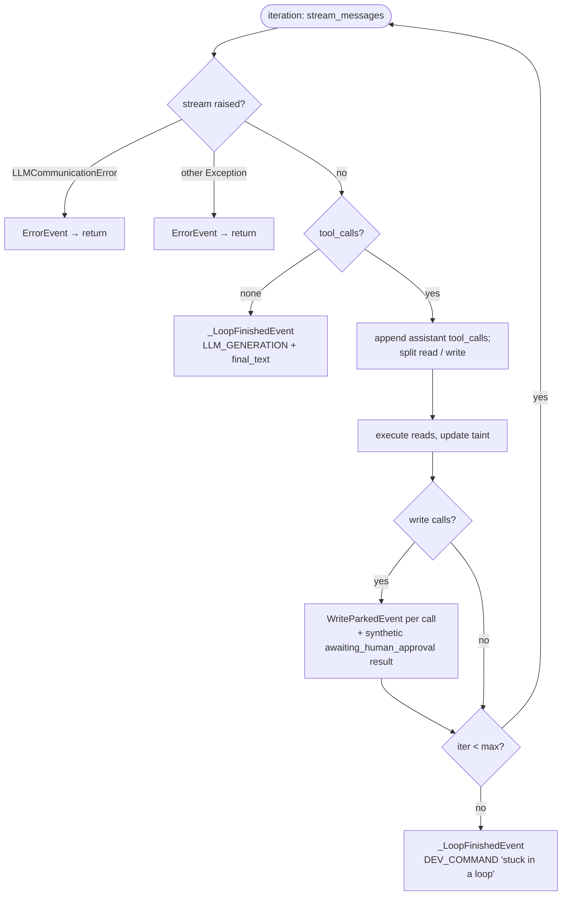

# Tool-use loop — exit paths & cleanup invariants

Design reference for the agent tool-use loop. The happy path (stream → tool
calls → execute → repeat) is readable in the code; what is *not* obvious is the
fan-out of **termination paths** and the obligations each one owes. Every bug
found in the May 2026 audit was a cell in this matrix that nothing checked.

Components:
- `ToolLoop.run` (`src/tools/tool_loop.py`) — one iteration of stream/execute.
- `ChatSystem._orchestrate` (`src/chat_system.py`) — drives the loop, owns the
  turn lifecycle (context var, persistence, taint, terminal event).

Coverage: `tests/integration/test_tool_loop_exit_invariants.py`.

## The five invariants

Every way the turn can end must satisfy all five:

| ID | Invariant |
|----|-----------|
| **I1** | `get_turn_context()` is `None` after the turn — the per-turn `ContextVar` must not leak into the next request sharing the event-loop context. |
| **I2** | The user turn is persisted (and retained through the backend) even when the model errors mid-flight. |
| **I3** | The assistant turn is persisted **iff** `final_text` is non-empty **and** `response_type == LLM_GENERATION`. |
| **I4** | `_conversation_taints[key]` is written with the correct sticky taint value. |
| **I5** | Exactly one terminal event is emitted (`DoneEvent` XOR `ErrorEvent`), with nothing trailing it. |

`recall_memory` (DP-113) reads the turn `ContextVar` to scope the memory bank,
so an **I1** violation is a cross-scope memory bug, not just hygiene: the next
turn in the same context recalls against the previous turn's persona/user/channel.

## ToolLoop.run terminal events

```mermaid
flowchart TD
  start([iteration: stream_messages]) --> err{stream raised?}
  err -- LLMCommunicationError --> e1[ErrorEvent → return]
  err -- other Exception --> e2[ErrorEvent → return]
  err -- no --> tc{tool_calls?}
  tc -- none --> fin[_LoopFinishedEvent\nLLM_GENERATION + final_text]
  tc -- yes --> split[append assistant tool_calls;\nsplit read / write]
  split --> reads[execute reads, update taint]
  reads --> w{write calls?}
  w -- yes --> park[WriteParkedEvent per call\n+ synthetic awaiting_human_approval result]
  park --> loop
  w -- no --> loop{iter < max?}
  loop -- yes --> start
  loop -- no --> stuck[_LoopFinishedEvent\nDEV_COMMAND 'stuck in a loop']
```

**Two guards sit in front of the park branch** (both inject a synthetic result and
create *no* second affordance):

- `pending_lookup` → `duplicate_of_pending`. The model re-proposed a write while
  an identical one is still waiting. Keyed on `write_call_identity` (name +
  canonicalized args, provider call id excluded — two re-proposals of the same
  action always carry different ids, which is exactly the case to catch). The
  suppressed call is emitted as a `_WriteDuplicateEvent` so the orchestrator can
  patch its history entry when the *original* resolves.
- `resolved_lookup` → `already_resolved` (DP-319). The model re-proposed a write
  that was already **executed or refused**. Backed by `Parked_Writes` rows within
  `PARK_REEXECUTION_GUARD_WINDOW` (15 min). **Continuation turns only** — the
  pending guard is structurally blind during a continuation (the park was already
  taken), which is precisely when the model re-reads its own tool span and
  re-proposes. Left running on ordinary turns it would answer a legitimate
  "restart that service again" with "that already happened", silently.

Because `MAX_TOOL_CALLS` is 10 (raised from 5 in DP-297 — a parked write now
costs an iteration instead of ending the turn), a turn can park several writes
and still finish on ordinary text.

## _orchestrate exit paths × invariants

Line numbers below are `src/chat_system.py` as of DP-324 (`963c074`) — treat them
as a starting point, not a contract.

| Exit path (line) | Terminal event | I1 reset? | Notes |
|------------------|----------------|-----------|-------|
| dev-command short-circuit (300) | DoneEvent | n/a | returns before `turn_scope` is entered |
| persona not found (308) | DoneEvent | n/a | returns before `turn_scope` is entered |
| DP-128 quarantine gate (325) | DoneEvent (DEV_COMMAND) | n/a | returns before `turn_scope` is entered; sits *after* the dev-command branch on purpose, so `set tools …` can repair the persona in-band without a restart |
| `request_builder.prepare_request` raises (359) | ErrorEvent | ✅ `turn_scope` | inside the scope since the `turn_scope` rework — no separate manual reset |
| loop emits ErrorEvent (561) | ErrorEvent | ✅ `turn_scope` | covers `LLMCommunicationError`; commits the assistant row from the sealed tool context first, then `_register_parks` / `_register_duplicates` against that row — writes gated before the loop died are still real proposals |
| `CancelledError` (571) | re-raises | ✅ `turn_scope` | flushes partial assistant text |
| normal LLM_GENERATION | DoneEvent | ✅ `turn_scope` | guaranteed on full drain *and* early break |
| parked write(s) | DoneEvent (LLM_GENERATION) | ✅ `turn_scope` | DP-297: parking is mid-turn, not an exit — the loop continues and the turn ends normally |
| `turn_persistence.log_user_turn` raises | propagates | ✅ `turn_scope` | now inside the scope |
| max-iter DEV_COMMAND | DoneEvent | ✅ `turn_scope` | |
| `continuation` re-entry (DP-297) | DoneEvent / ErrorEvent | ✅ `turn_scope` | shares the kernel; history is rebuilt LIVE from the DB after each decision is patched |

**Fix for #1 — `turn_scope` + `aclosing` (two non-obvious parts):**

1. `_orchestrate` wraps its whole body in `with turn_scope(TurnContext(...))`
   (`src/tools/turn_context.py`), so the ContextVar is restored on *every*
   exit — return, exception, or `GeneratorExit`. The scattered manual resets
   are gone; a new exit path can't forget to reset.

2. `turn_scope` **restores the prior value with `set(prev)`, not
   `ContextVar.reset(token)`.** `_orchestrate` is an async generator: `set()`
   runs during one `__anext__`, but cleanup can run during a later `aclose()`
   in a *different* `Context`, where `reset(token)` raises
   *"Token was created in a different Context."* Restore-by-value has no such
   coupling.

3. The public entry points iterate `_orchestrate` via
   **`async with aclosing(self._orchestrate(...)) as agen`**, not a bare
   `async for`. A plain `async for` over a sub-generator does **not** propagate
   `aclose()` when the outer generator is torn down, so the inner
   `turn_scope` finally never runs and the scope still leaks on early consumer
   break. `aclosing` forces the inner close. (Verified: nested generators with
   plain delegation leak; with `aclosing` they don't.)

> **Lesson for any scoped ContextVar in a streaming generator:** manage it with
> a restore-by-value context manager, and make every layer that delegates to a
> sub-generator use `aclosing`. Manual set/reset across `yield` is a leak
> waiting for the next exit path.

## Related findings (fixed)

- **#2 — tool-call identity normalized at ingestion** (`ToolLoop.run`): every
  call gets a stable `id` the moment it comes off the stream, so the three
  consumers (assistant message, lifecycle events, tool-result history) agree
  by construction. A provider that omits `id` no longer produces a null
  `tool_call_id` that breaks call↔result pairing on the next iteration.
- **#3 — read group executes concurrently** (`ToolLoop._execute_calls`): calls
  in one batch share a `group_id` because they're independent, so they're
  dispatched with `asyncio.gather`; results are appended/emitted in original
  order to keep the transcript stable. Writes are gated rather than executed,
  so only the read group is parallelized.

## stream_resolve_park re-enters the kernel (DP-124, reworked by DP-297)

`stream_resolve_park` does not re-implement the loop. It re-enters
`_orchestrate(continuation=_ContinuationState(batch))`, which skips the
fresh-request front half (dev-command preprocess, user-turn logging) and then
runs the shared tool loop + persistence tail.

DP-124 passed `_ResumeState(pending, approved)` — the parked turn's **snapshot**
of history, with the approved write's result spliced in. DP-297 deleted that:
once several parks are resolvable in any order, every snapshot predates its
siblings, so replaying one forks the conversation. The continuation now rebuilds
history **live from the DB**, where `ConfirmationManager.apply()` has already
patched each resolved write's entry with its real outcome — execute-then-patch
ordering exists precisely so the model reads what actually happened.

Consequences:

- decisions that arrive while the lock is held are folded into **one**
  continuation (`drain()` in a loop), not N racing tool loops over one history;
- the continuation can run a **further tool loop** and re-park if it issues
  another write — the same `WriteParkedEvent` branch handles it;
- the assistant row is persisted on the **real channel** (`parked.channel`),
  not the old hardcoded `channel=""`;
- `turn_scope`, taint write-back, retain, and the terminal event live in
  **exactly one place**;
- the turn opens on `_render_resolution_nudge`, a synthetic user message that
  is deliberately **not** persisted — it exists because ending the array on the
  parked assistant message makes Anthropic treat it as a prefill to continue
  rather than a turn to answer.

Audit-decision logging (`ConfirmationManager.apply`) and the expiry check are
preserved, the latter ahead of kernel re-entry.
Coverage: `tests/integration/test_resume_kernel_convergence.py`.
