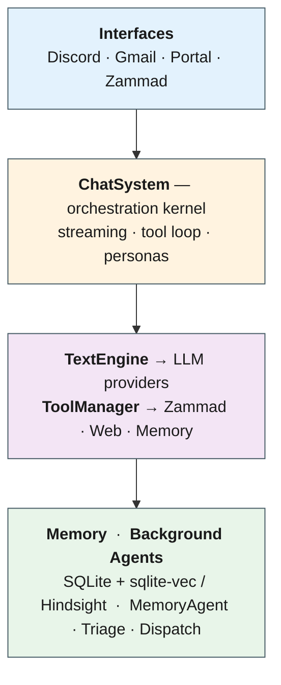

This is the derpr agent-orchestrator repository.

# DERPR — LLM Orchestration Engine

An async, provider-agnostic LLM orchestration engine for chatbot automation: IT support, ticketing, and conversational AI. The same engine runs across Discord, Gmail, a self-hosted web portal (kobold-lite), and a Zammad triage pipeline, with a tiered long-term memory system built on top of SQLite + a vector store.

> **Status:** active development, no public release. Multiple subsystems (Hindsight memory backend, tool-security framework, portal Phase D) are mid-rollout. Treat configuration and module layout as moving targets — pin commits, not branches.

## What it does

- **Chat orchestration.** One `ChatSystem` brokers requests across providers (OpenAI, Anthropic, Google Gemini/Gemma, OpenAI-compatible local). Streaming-first: token deltas, tool calls, and tool results all flow through a single event stream.
- **Multi-interface.** Discord bot (primary), Gmail (PoC), Zammad agents, and a FastAPI portal serving a customised kobold-lite at `/portal` with persona CRUD, DB-as-source history, version chevrons for regenerations, and engine-side prompt/budget management on the OAI route.
- **Persona system.** Stateful LLM configs with `ExecutionMode` (AUTONOMOUS / CONFIRM) and `MemoryMode` (CHANNEL_ISOLATED, SERVER_WIDE, PERSONAL, GLOBAL, TICKET_ISOLATED). Runtime-mutable through `set` commands; persisted to `data/personas.json`.
- **Tool loop.** JSON-schema tools dispatched via `ToolManager`, capped at 5 iterations per request, with read/write classification, service-binding gating, and CONFIRM-mode approval flows on Discord.
- **Autonomous agents.** Background workers on interval schedules: `ZammadBot` (multi-stage triage via system personas), `DispatchAgent` (priority + notification routing), `MemoryAgent` (segment + summarize + embed), `MemoryConsolidator` (cluster L1 summaries into L2 core profiles).
- **Tiered memory.** Sliding-window history from SQLite plus semantic recall via either `SqliteSemanticBackend` (default, sqlite-vec) or `HindsightBackend` (alpha, REST to a Dockerised hindsight + pgvector). Engine-side recall is routed through the `MemoryBackend` ABC; transcript layer (logging, suppression, edit/version history, audit) stays on `MemoryManager`.

## Architecture



Async pipeline: any interface produces a request, `ChatSystem` runs a streaming tool loop over the configured persona's model, and resolved turns persist into a tiered memory store while background agents triage tickets and consolidate long-term memory out-of-band.

Full component diagram (every class, every edge) → [`docs/architecture.mmd`](docs/architecture.mmd) · component reference → [`memory/codebase/architecture.md`](memory/codebase/architecture.md).

## Tech stack

| Category   | Used                                                                                  |
|------------|---------------------------------------------------------------------------------------|
| Runtime    | Python 3.14, `asyncio` throughout                                                     |
| Storage    | SQLite (`sqlite-vec` for KNN); optional Postgres + pgvector via Hindsight container   |
| LLM APIs   | OpenAI, Anthropic, Google Gemini/Gemma, OpenAI-compatible local (kobold.cpp, Ollama)  |
| Embeddings | `gemini-embedding-001` (3072-d, L2-normalised)                                        |
| Web        | FastAPI + uvicorn (portal/adapter), discord.py, google-api-python-client              |
| Packaging  | Docker + Docker Compose; `pip-compile` (requirements.in → requirements.txt)           |
| Testing    | pytest, pytest-asyncio, `unittest.mock`; 4-tier markers (unit/integration/zammad_live/llm_live) |

## Repository layout

```
src/
  chat_system.py         DI hub + orchestration kernel
  engine.py              Provider-agnostic TextEngine — one streaming driver
                         per provider; one-shot = collect(stream) (DP-206)
  stream_engine.py       Kobold-native local transport (engine-owned)
  llm_errors.py          LLMCommunicationError leaf
  message_handler.py     BotLogic — dev commands (set/what/dump_*/help/…)
  persona.py             Persona dataclass + modes
  generation_events.py   Streaming event surface (TokenEvent, DoneEvent, …)
  tools/                 Tool definitions, ToolManager, ToolLoop, turn_context
  memory/                MemoryManager, backend ABC, SQLite + Hindsight impls,
                         consolidation, context budget, router
  agents/                Agent ABC, AgentManager, ZammadBot, DispatchAgent,
                         MemoryAgent, AgentServiceIntegration
  interfaces/            discord_bot, gmail_bot, kobold_adapter (FastAPI portal),
                         kobold_export
  clients/               ZammadClient + ZammadIntegration, NotificationRouter,
                         Notifier impls, ServiceIntegration ABC
  personas/              store.py — persona/model file persistence
  utils/                 google_utils, message_utils, model_utils
  app_manager.py         Top-level lifecycle
  main.py                Startup wiring
config/                  global_config.py, default_personas.json,
                         system_personas.json, agents.json
docs/                    user_guide.md (user-facing spec), architecture/
memory/                  Tiered memory notes (L0 MEMORY.md → L1 _overview → L2)
tests/                   4-tier pytest suite
```

## Quickstart

### Prerequisites

- Python 3.14 (matches the Docker base image; 3.10+ may work but is unverified)
- API keys for whichever providers you want enabled (see [Environment](#environment))
- Optional: a Zammad instance for ticketing flows; Docker + a local kobold.cpp for the Hindsight backend / portal

### Local install

```bash
git clone <repo-url> derpr-python
cd derpr-python
python -m venv .venv
.\.venv\Scripts\Activate.ps1     # PowerShell — bash: source .venv/bin/activate
pip install -r requirements.txt
```

Create a `.env` in the repo root (no `.env.example` is checked in yet) and fill in only the keys you need — every provider key is optional; missing services are skipped at startup.

### Run

```bash
python -m src.main
```

Once the bot is online, message a persona on Discord (e.g. `gemini hello`) or open the portal at `http://localhost:<adapter-port>/portal`. Use `help` in any channel to list commands; the full command surface is documented in [`docs/user_guide.md`](docs/user_guide.md).

### Docker

```bash
docker compose up -d --build      # main app
```

The optional Hindsight semantic-memory stack is **deployed out-of-repo** on `aux-desktop` / `derpr-host` (`10.0.0.70`) at `C:\Server\Hindsight\` — this repo no longer ships a Hindsight compose template. It runs the API server with no internet egress; an nginx LB sidecar (`kobold-lb.conf`) routes LLM traffic to LAN kobold.cpp instances. See `docs/user_guide.md` (Hindsight section) for deployment, bank bootstrap, backup/restore, and failure modes.

## Environment

All variables are read directly via `os.environ` — set them in `.env` or your shell. None are required globally; each enables a specific subsystem.

| Variable | Purpose |
|----------|---------|
| `DISCORD_API_KEY` | Enables Discord bot |
| `OPENAI_API_KEY` | OpenAI provider |
| `ANTHROPIC_API_KEY` | Anthropic provider |
| `GOOGLE_GENERATIVEAI_API_KEY` | Gemini/Gemma + embeddings |
| `LOCAL_LLM_URL` | Override for OpenAI-compatible local endpoint (default `http://omen:5001/v1`) |
| `ZAMMAD_URL`, `ZAMMAD_API_KEY` | Enables ZammadClient + Zammad agents |
| `GMAIL_CREDENTIALS_FILE`, `GMAIL_TOKEN_FILE`, `GMAIL_PROJECT_ID`, `GMAIL_PUBSUB_TOPIC`, `GMAIL_PUBSUB_SUBSCRIPTION_ID` | Gmail PoC interface |
| `MEMORY_DATABASE_FILE` | SQLite path (default `data/user_memory.db`) |
| `KOBOLD_DEFAULT_PERSONA` | Persona served when the portal opens with no selection |
| `DISCORD_DEBUG_CHANNEL` | Channel id excluded from response handling |
| `SEMANTIC_BACKEND`, `HINDSIGHT_URL` | Switch semantic recall to Hindsight (alpha) |
| `RATE_LIMIT_*` | Per-family RPM/RPD/TPR overrides — see `config/global_config.py` |

## Testing

```bash
pytest                                                                    # everything; live tiers auto-skip without creds
pytest -m "not zammad_live and not llm_live and not discord_live"          # CI default
pytest -m "not integration and not zammad_live and not llm_live and not discord_live"  # unit only
pytest -m zammad_live                                                     # against a live Zammad
pytest -m llm_live                                                        # against real LLM APIs
pytest --cov=src
```

Test Zammad credentials live in `.env.test` (gitignored, loaded with `override=True` so production is never hit). Migration tests use the `legacy_mem_manager` fixture pattern — see `CLAUDE.md` for the mandatory-test rules around schema, config, and startup-wiring changes.

Static checks:

```bash
flake8 src/
mypy src/ --config-file mypy.ini
```

## Documentation

- [`docs/user_guide.md`](docs/user_guide.md) — user-facing behaviour: interfaces, commands, personas, modes, tools, agents, long-term memory, Hindsight bring-up. Doubles as the spec for new features (write here before implementing).
- [`docs/architecture/`](docs/architecture) — split design notes (overview, decisions, plans, research, roadmap).
- [`memory/codebase/architecture.md`](memory/codebase/architecture.md) — exhaustive component reference: data flow, schemas, tables, indexes, startup sequence.
- [`CLAUDE.md`](CLAUDE.md) — contributor rules: parallel-agent / worktree workflow, mandatory tests, memory-update protocol.

## License

See [`LICENSE`](LICENSE).
