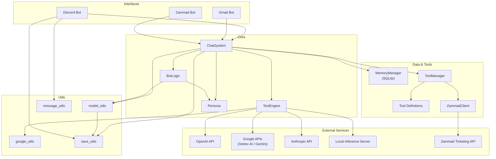
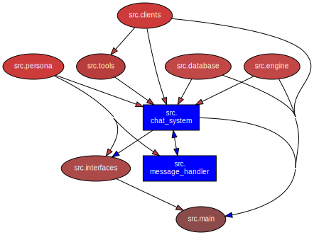

---

# Production-Ready LLM Orchestration Engine

This project is a complete, end-to-end AI chatbot system designed for real-world application. It functions as a provider-agnostic orchestration engine, capable of integrating with multiple LLM providers, external services, and user interfaces to solve complex business problems like automated IT service dispatch. It is architected for reliability, scalability, and ease of maintenance.

---

## Core Features

*   **Provider-Agnostic LLM Engine:** A standardized interface abstracts the unique request/response schemas of multiple providers, including OpenAI, Google (Vertex AI & Gemini API), Anthropic, and local OpenAI-compatible servers (e.g., Llama.cpp, Ollama). This allows for seamless model switching and performance comparison.

*   **Asynchronous & Modular Architecture:** Built on `asyncio`, the system is fully non-blocking. It uses dependency injection to decouple core logic from external interfaces (Discord, Gmail) and services, ensuring high performance and maintainability.

*   **Robust Tool Integration:** Features a multi-step tool execution loop, enabling the LLM to perform complex, agentic tasks by chaining API calls (e.g., search user, create ticket, add note) and feeding the results back into its context for subsequent reasoning.

*   **Multi-Modal Memory System:** A stateful persona management system provides precise, contextually-aware conversational history to the LLM using multiple retrieval strategies (e.g., ticket-isolated, channel-wide, personal history) from a persistent SQLite database.

*   **Comprehensive Testing Suite:** The project is validated by a multi-layered testing strategy using Pytest, including isolated unit tests with mocks and high-fidelity integration tests that run against a live Zammad ticketing instance to ensure verifiably correct behavior.

*   **Multi-Interface Support:** The decoupled design allows the core engine to connect to various front-ends, with current implementations for Discord and the Gmail API.

## Architecture

The system is designed with a clear separation of concerns, allowing for independent development and testing of its core components.



### Module Dependency Graph

Generated from source via [pydeps](https://github.com/thebjorn/pydeps) (`pydeps src --no-show`). Update when module structure changes.



## Tech Stack

| Category      | Technologies                                                                          |
|---------------|---------------------------------------------------------------------------------------|
| **Backend**   | Python 3.10+, `asyncio`                                                               |
| **Database**  | SQLite                                                                                |
| **LLM APIs**  | OpenAI, Google Cloud (Vertex AI, Gemini), Anthropic, OpenAI-compatible local servers  |
| **DevOps**    | Docker, Docker Compose, CI/CD (GitHub Actions)                                        |
| **Testing**   | Pytest, `pytest-asyncio`, `unittest.mock`                                             |
| **Core Libs** | `aiohttp`, `google-genai`, `google-api-python-client`, `anthropic`, `openai`             |


---

## Getting Started

### Prerequisites

*   Python 3.10+
*   Access to the various service APIs you intend to use.

### Setup & Installation

1.  **Clone the repository:**
    ```bash
    git clone https://github.com/addrick/llm-orchestrator.git
    cd llm-orchestrator
    ```

2.  **Create a virtual environment (recommended):**
    ```bash
    python -m venv venv
    source venv/bin/activate  # On Windows, use `venv\Scripts\activate`
    ```

3.  **Install dependencies:**
    ```bash
    pip install -r requirements.txt
    ```

4.  **Configure your environment:**
    Create a file named `.env` in the root of the project by copying the example file.
    ```bash
    cp .env.example .env
    ```
    Now, edit the `.env` file and fill in your API keys and other configuration details.

    Once online, you can use 'help' for a list of commands:
    

pytest
```
_Note: The integration test suite (`tests/integration`) requires a live, configured Zammad instance to run successfully._
