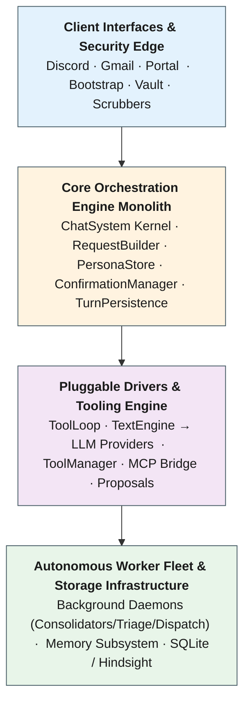

LLM Orchestration Engine

An async, provider-agnostic LLM orchestration engine for chatbot automation: IT support, ticketing, and conversational AI. The same engine runs across Discord, Gmail, a self-hosted web portal, and a Zammad triage pipeline, with a tiered long-term memory system built on top of SQLite + a vector store.

> **Status:** active development, no public release. Multiple subsystems (Hindsight memory backend, tool-security framework, portal Phase D) are mid-rollout. Treat configuration and module layout as moving targets — pin commits, not branches.

## What it does

- **Chat orchestration.** One `ChatSystem` brokers requests across six providers (OpenAI, Anthropic, Google Gemini/Gemma, a local KoboldCPP or Strata server over OpenAI chat-completions, and the `agy` and Claude Code CLIs). Streaming-first: token deltas, tool calls, and tool results all flow through a single event stream.
- **Multi-interface.** Discord bot (primary), Gmail (PoC), Zammad agents, and a FastAPI web portal (React, at `/derpr`) with persona CRUD, DB-as-source history, version chevrons for regenerations, and engine-side prompt/budget management on the OAI route.
- **Persona system.** Stateful LLM configs with `ExecutionMode` (AUTONOMOUS / CONFIRM) and `MemoryMode` (CHANNEL_ISOLATED, SERVER_WIDE, PERSONAL, GLOBAL, TICKET_ISOLATED). Runtime-mutable through `set` commands; persisted to `data/personas.json`.
- **Tool loop.** JSON-schema tools dispatched via `ToolManager`, budgeted at 15 executed tool calls per request (plus a 25-round-trip runaway guard), with read/write classification, service-binding gating, and every write parked for human approval regardless of execution mode.
- **Autonomous agents.** Background workers on interval schedules: `ZammadBot` (multi-stage triage via system personas), `DispatchAgent` (priority + notification routing), `ReminderAgent` (open-ticket nudges), `ManagrAgent` (triage manager that emits human-approved proposals), `SqliteConsolidator` (segment + summarize + embed, SQLite backend only). Also: the `fixr` self-edit supervisor, Proxmox and HuggingFace model-management tools, an MCP client and bridge, and an optional voice pipeline — see `docs/architecture/overview.md`.
- **Tiered memory.** Sliding-window history from SQLite plus semantic recall via either `SqliteSemanticBackend` (default, sqlite-vec) or `HindsightBackend` (alpha, REST to a Dockerised hindsight + pgvector). Engine-side recall is routed through the `MemoryBackend` ABC; transcript layer (logging, suppression, edit/version history, audit) stays on `MemoryManager`.

## Architecture


```mermaid
flowchart TB
    EDGE["<b>Client Interfaces &amp; Security Edge</b><br/>Discord · Gmail · Portal &nbsp;·&nbsp; Bootstrap · Vault · Scrubbers"]
    CORE["<b>Core Orchestration Engine Monolith</b><br/>ChatSystem Kernel · RequestBuilder · PersonaStore · ConfirmationManager · TurnPersistence"]
    DRIVERS["<b>Pluggable Drivers &amp; Tooling Engine</b><br/>ToolLoop · TextEngine → LLM Providers &nbsp;·&nbsp; ToolManager · MCP Bridge · Proposals"]
    FLEET["<b>Autonomous Worker Fleet &amp; Storage Infrastructure</b><br/>Background Daemons (Consolidators/Triage/Dispatch) &nbsp;·&nbsp; Memory Subsystem · SQLite / Hindsight"]

    EDGE    --> CORE
    CORE    --> DRIVERS
    DRIVERS --> FLEET

    classDef edge_s   fill:#E3F2FD,stroke:#455A64,color:#1A1A1A;
    classDef core_s   fill:#FFF3E0,stroke:#455A64,color:#1A1A1A;
    classDef driver_s fill:#F3E5F5,stroke:#455A64,color:#1A1A1A;
    classDef fleet_s  fill:#E8F5E9,stroke:#455A64,color:#1A1A1A;
    class EDGE edge_s;
    class CORE core_s;
    class DRIVERS driver_s;
    class FLEET fleet_s;
```

Async pipeline: any interface produces a request, `ChatSystem` runs a streaming tool loop over the configured persona's model, and resolved turns persist into a tiered memory store while background agents triage tickets and consolidate long-term memory out-of-band.

Full component diagram (every class, every edge) → [`docs/architecture.mmd`](docs/architecture.mmd) · component reference → [`docs/architecture/architecture.md`](docs/architecture/architecture.md).

## Tech stack

| Category   | Used                                                                                  |
|------------|---------------------------------------------------------------------------------------|
| Runtime    | Python 3.14, `asyncio` throughout                                                     |
| Storage    | SQLite (`sqlite-vec` for KNN); optional Postgres + pgvector via Hindsight container   |
| LLM APIs   | OpenAI, Anthropic, Google Gemini/Gemma, local KoboldCPP / Strata (chat-completions), `agy` CLI, Claude Code CLI |
| Embeddings | `gemini-embedding-001` (3072-d, L2-normalised)                                        |
| Web        | FastAPI + uvicorn (portal/adapter), discord.py, google-api-python-client              |
| Packaging  | Docker + Docker Compose; `uv pip compile` (requirements.in → requirements.txt)           |
| Testing    | pytest, pytest-asyncio, `unittest.mock`; tiered markers — see `docs/testing.md` |

## Repository layout

```
src/
  chat_system.py         DI hub + orchestration kernel
  engine/                Provider-agnostic TextEngine (driver.py), ProviderRegistry,
                         and one streaming driver per provider in providers/
  llm_errors.py          LLMCommunicationError leaf
  message_handler.py     BotLogic — dev commands (set/what/dump_*/help/…)
  persona.py             Persona dataclass + modes
  generation_events.py   Streaming event surface (TokenEvent, DoneEvent, …)
  tools/                 Tool definitions, ToolManager, ToolLoop, turn_context
  memory/                MemoryManager, backend ABC, SQLite + Hindsight impls,
                         consolidation, context budget, router
  agents/                Agent ABC, AgentManager, ZammadBot, DispatchAgent,
                         ReminderAgent, ManagrAgent, ContentClassifier, DateTagger,
                         SqliteConsolidator, AgentServiceIntegration
  interfaces/            discord_bot, gmail_bot, kobold_engine_adapter (FastAPI
                         portal), transcript
  clients/               ZammadClient + ZammadIntegration, NotificationRouter,
                         Notifier impls, ServiceIntegration ABC
  personas/              store.py — persona/model file persistence
  utils/                 timeutil, atomic_json, git_support, cc_sandbox,
                         claude_cli_env, notes_workspace, history_shape,
                         google_utils, message_utils, model_utils
  bootstrap/  database/  proposals/  security/  self_edit/  voice/
  proxmox/  huggingface/  — subsystems; see docs/architecture/architecture.md
  app_manager.py         Top-level lifecycle
  main.py                Startup wiring
config/                  global_config.py, default_personas.json,
                         system_personas.json, agents.json
docs/                    user_guide.md (user-facing spec), architecture/
memory/                  (gitignored) private notes repo, absent from a public clone
tests/                   tiered pytest suite (docs/testing.md)
```

## Quickstart

### Prerequisites

- Python 3.14 (matches the Docker base image; 3.10+ may work but is unverified)
- API keys for whichever providers you want enabled (see [Environment](#environment))
- Optional: a Zammad instance for ticketing flows; Docker + a local kobold.cpp for the Hindsight backend / portal

### Local install

```bash
git clone <repo-url> agent-orchestrator
cd agent-orchestrator
python -m venv .venv
.\.venv\Scripts\Activate.ps1     # PowerShell — bash: source .venv/bin/activate
pip install -r requirements-dev.txt   # runtime + test/lint tools (requirements.txt is runtime only)
```

Create a `.env` in the repo root (no `.env.example` is checked in yet) and fill in only the keys you need — every provider key is optional; missing services are skipped at startup.

### Run

```bash
python -m src.main
```

Once the bot is online, message a persona on Discord (e.g. `gemini hello`) or open the portal at `http://localhost:<adapter-port>/derpr/`. Use `help` in any channel to list commands; the full command surface is documented in [`docs/user_guide.md`](docs/user_guide.md).

### Docker

```bash
docker compose up -d --build      # main app
```

The optional Hindsight semantic-memory stack is **deployed out-of-repo** on the production host — this repo no longer ships a Hindsight compose template. It runs the API server with no internet egress; an nginx LB sidecar (`kobold-lb.conf`) routes LLM traffic to LAN kobold.cpp instances. See `docs/user_guide.md` (Hindsight section) for deployment, bank bootstrap, backup/restore, and failure modes.

## Environment

All variables are read directly via `os.environ` — set them in `.env` or your shell. None are required globally; each enables a specific subsystem.

| Variable | Purpose |
|----------|---------|
| `DISCORD_API_KEY` | Enables Discord bot |
| `OPENAI_API_KEY` | OpenAI provider |
| `ANTHROPIC_API_KEY` | Anthropic provider |
| `GOOGLE_GENERATIVEAI_API_KEY` | Gemini/Gemma + embeddings |
| `LOCAL_LLM_URL` | Override for the local KoboldCPP / Strata endpoint (default in `config/global_config.py`) |
| `ZAMMAD_URL`, `ZAMMAD_API_KEY` | Enables ZammadClient + Zammad agents |
| `GMAIL_CREDENTIALS_FILE`, `GMAIL_TOKEN_FILE`, `GMAIL_PROJECT_ID`, `GMAIL_PUBSUB_TOPIC`, `GMAIL_PUBSUB_SUBSCRIPTION_ID` | Gmail PoC interface |
| `DATA_DIR` | Where all mutable state lives (default `./data`; the container sets `/data`, outside the app tree) |
| `MEMORY_DATABASE_FILE` | SQLite path (default `<DATA_DIR>/user_memory.db`) |
| `KOBOLD_DEFAULT_PERSONA` | Persona served when the portal opens with no selection |
| `DISCORD_DEBUG_CHANNEL` | Channel id excluded from response handling; when set, also overrides agents.json `recipients.debug` as the destination of the node-artifact drift report |
| `SEMANTIC_BACKEND`, `HINDSIGHT_URL` | Switch semantic recall to Hindsight (alpha) |
| `RATE_LIMIT_*` | Per-family RPM/RPD/TPR overrides — see `config/global_config.py` |

## Testing

```bash
pytest                                                                    # everything; live tiers auto-skip without creds
pytest -n auto -m "not integration"                                       # what CI and the pre-push hook run
pytest -m "not integration and not zammad_live and not llm_live and not discord_live"  # unit only
pytest -m zammad_live                                                     # against a live Zammad
pytest -m llm_live                                                        # against real LLM APIs
pytest --cov=src
```

Test Zammad credentials live in `.env.test` (gitignored, loaded with `override=True` so production is never hit). Migration tests use the `legacy_mem_manager` fixture pattern — see [`docs/testing.md`](docs/testing.md) for the mandatory-test rules around schema, config, and startup-wiring changes.

Static checks:

```bash
flake8 src/ services/              # advisory: CI gates only the hard-error subset (E9,F63,F7,F82)
mypy src/ services/ --config-file mypy.ini
lint-imports                      # layer contracts (setup.cfg)
python scripts/ci_check.py        # all of CI's gates in one go
```

## Documentation

- [`docs/user_guide.md`](docs/user_guide.md) — user-facing behaviour: interfaces, commands, personas, modes, tools, agents, long-term memory, Hindsight bring-up. Doubles as the spec for new features (write here before implementing).
- [`docs/architecture/`](docs/architecture) — split design notes (overview, architecture, external, research, roadmap). Decision records (ADRs) live in the private notes repo, not here.
- [`docs/architecture/architecture.md`](docs/architecture/architecture.md) — exhaustive component reference: data flow, schemas, tables, indexes, startup sequence.
- [`docs/capability_map.md`](docs/capability_map.md) and [`docs/mechanism_ledger.md`](docs/mechanism_ledger.md) — capability → implementation, and the same question keyed on mechanism. Read before adding anything that "already exists somewhere".
- [`docs/testing.md`](docs/testing.md) — test tiers, markers, mandatory test requirements.
- [`CLAUDE.md`](CLAUDE.md) — repo-specific parameters for coding agents (commands, ticket prefix, docs contract).

## License

See [`LICENSE`](LICENSE).
